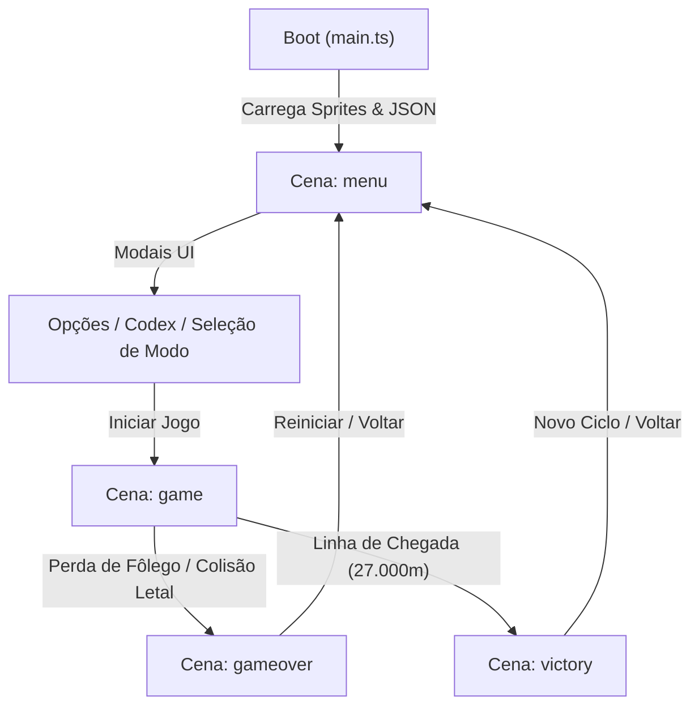
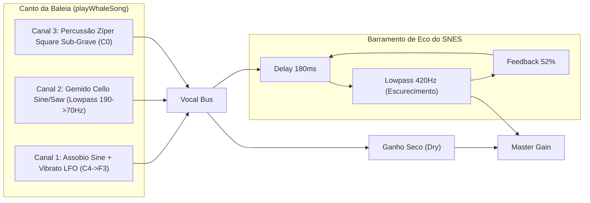

# 🏗️ Arquitetura do Sistema - Micro Splash

O **Micro Splash** foi construído sobre uma arquitetura modular orientada a eventos e componentes, utilizando a engine **Kaboom.js** combinada a **TypeScript**, **Web Audio API** para síntese procedural em tempo real e empacotamento ultrarrápido via **Vite**.

---

## 🗂️ Estrutura de Diretórios e Módulos

```
micro-splash/
├── data/
│   └── facts.json              # Acervo pedagógico de curiosidades marinhas indexadas por bioma
├── docs/
│   ├── ARCHITECTURE.md         # Este documento (visão técnica e estrutural)
│   ├── GDD.md                  # Game Design Document completo
│   ├── OCEAN_FACTS.md          # Fundamentação científica e artigos revisados por pares
│   └── ROADMAP.md              # Roteiro de fases e status de entrega
├── public/
│   └── sprites/
│       └── whale.png           # Spritesheet anatômico de 4 quadros da Baleia-Jubarte (512x64px)
├── scripts/
│   └── generateWhaleSprite.cjs # Script Canvas procedural gerador do spritesheet pixel art
├── src/
│   ├── config.ts               # Parâmetros físicos, biomas, sementes, tags e dimensões
│   ├── main.ts                 # Ponto de entrada, boot do Kaboom.js e máquina de estados de cenas
│   ├── entities/               # Fábricas de atores e objetos interativos do jogo
│   │   ├── iceberg.ts          # Plataforma de gelo polar com fendas de respiração
│   │   ├── krill.ts            # Cardumes alimentares com atração magnética e física oscilatória
│   │   ├── net.ts              # Redes de pesca fantasma com mecânica de enredamento e ruptura
│   │   ├── player.ts           # Jubarte: nado senoidal, animações, sonar 360°, fôlego e esguicho
│   │   ├── ship.ts             # Cargueiros industriais móveis com ruído e perigo de colisão
│   │   └── trash.ts            # Lixo plástico camuflado no fundo com revelação por sonar
│   ├── systems/                # Sistemas de simulação de mundo e áudio
│   │   ├── audioSystem.ts      # Motor de áudio Web Audio API: trilha 16-bit, canto da baleia e SFX
│   │   ├── backgroundFauna.ts  # Fauna decorativa: orcas, jubartes passantes e berçário mãe/filhote
│   │   ├── benthicFloorSystem.ts # [Fase 8] Florestas de Kelp (Antártica) e Recifes de Corais (Arraial)
│   │   ├── biomeSystem.ts      # Gerenciamento de profundidade, cor da água e densidade por bioma
│   │   ├── canyonSystem.ts     # Geração procedural dos cânions rochosos do Boqueirão
│   │   ├── collisions.ts       # Detecção e resposta a colisões físicas, dano e salvamento
│   │   ├── lightRaysSystem.ts  # [Fase 8] Feixes de luz volumétricos (God Rays) e cáusticos de superfície
│   │   ├── oceanFloorSystem.ts # Topografia e leito oceânico em relevo contínuo
│   │   ├── parallaxSkySystem.ts # [Fase 8] Nuvens em paralaxe, aves marinhas e Farol de Arraial
│   │   └── upwellingSystem.ts  # Jatos ascensionais de ressurgência com nutrientes
│   └── ui/                     # Camada visual de interface, menus e modais
│       ├── challengeEndScreen.ts # Tela de estatísticas do Desafio Rápido de 60 segundos
│       ├── codexScreen.ts      # Diário de Bordo da Expedição (espécies, fatos e IBJ)
│       ├── hud.ts              # Medidores dinâmicos de fôlego, progresso e notificações
│       ├── modeSelectModal.ts  # Seletor dos 3 modos de jogo (Normal, Serena, Rápida)
│       ├── optionsModal.ts     # Painel de controle de volume e SFX com persistência
│       └── victoryScreen.ts    # Relatório de Migração de 27.000m e Eco-Score final
```

---

## 🔄 1. Ciclo de Vida e Máquina de Cenas (`src/main.ts`)

O jogo gerencia a navegação entre estados através de 4 cenas principais do Kaboom.js:



- **`menu`**: Tela inicial receptiva com partículas bioluminescentes, recordes persistentes e interface modal bloqueante (`isModalOpen`).
- **`game`**: Instancia o mundo de 27.000m, o jogador, os sistemas de bioma, áudio, fauna e colisões de acordo com o modo selecionado.
- **`gameover`**: Sequência dramática com tentativa de resgate pela Guarda Marítima na Costa Urbana.
- **`victory`**: Clímax do Salto Majestoso (_Breach_), cálculo do Eco-Score e exibição da Sabedoria Ancestral herdada.

---

## 🐋 2. Entidade Jogador (`src/entities/player.ts`)

A Baleia-Jubarte é uma entidade multifacetada que unifica mecânicas de física hidrodinâmica, animação por spritesheet e sensoriamento ecolocalizador:

1. **Hidrodinâmica Senoidal:**
   - A propulsão via `Espaço` atinge o ápice de aceleração aos `0.3s` e decai a zero se segurada indefinidamente, incentivando o ritmo biológico natural de batida de cauda.
   - Arrasto hidrodinâmico (_drag_) e inércia contínua de fluido desaceleram suavemente o animal ao cessar o esforço.
2. **Spritesheet & Animações (`public/sprites/whale.png`):**
   - **`glide` (quadro 0):** Nado planado hidrodinâmico.
   - **`stroke_up` (quadro 1) & `stroke_down` (quadro 2):** Batida vigorosa dos flukes da cauda.
   - **`feed` (quadro 3):** Distensão das pregas ventrais e exposição de cerdas filtradoras (_baleen_) ao engolir krill.
3. **Esguicho do Espiráculo (_Blowhole Spout_):**
   - Ao emergir à superfície (`SEA_LEVEL`), dispara um esguicho duplo vertical em "V" com 32 partículas e ruído sibilante (_whoosh_) de descompressão pulmonar.
4. **Biosonar 360° Omnidirecional:**
   - Varredura de onda acústica em tela inteira (raio de 650px) ativada por `Shift`, `E` ou `X`.
   - Ilumina e destaca com contorno fluorescente objetos camuflados nas profundezas (lixo plástico, redes e paredes de cânions).

---

## 🎵 3. Sistema de Áudio Procedural 16-Bit (`src/systems/audioSystem.ts`)

O áudio do jogo é gerado **100% em tempo real** via Web Audio API, sem depender de arquivos pesados de MP3/WAV, recriando as técnicas de sintetizadores de 16-bits (SNES SPC700 / Trackers):



- **Trilha Adaptativa "Aquatic Ambiance" (David Wise):**
  - Andamento rigoroso de **75 BPM** em **Dó Menor**.
  - Baixo "wavetable" pulsante construído com 8 harmônicos e filtro passa-baixa analógico dinâmico.
  - Arpejos híbridos de harpa com micro-pitch drift combinados a formantes vocais de coral.
- **Canto da Baleia:** 3 canais estruturados em 3 frases musicais (Lamento Límpido, Mergulho Cavernoso e Percussão Biológica), disparados **exclusivamente** via sonar.

---

## 🗺️ 4. Geometria dos Biomas e Level Design (`src/config.ts` & `src/systems/`)

A rota de 27.000 metros é particionada em zonas geográficas e comportamentais estritas:

| Faixa (Metros)        | Bioma                         | Tom da Água                | Elementos Chave                                                               |
| :-------------------- | :---------------------------- | :------------------------- | :---------------------------------------------------------------------------- |
| **0m – 5.000m**       | Antártica (Alimentação Polar) | Azul Gélido (`#051c38`)    | Teto de gelo, fendas de respiração, fartura de Krill, silhuetas de orcas.     |
| **5.000m – 12.000m**  | Oceano Aberto (Travessia)     | Azul Escuro (`#0a2850`)    | Jejum total de Krill, correntes, nado de jubartes adultas ao fundo.           |
| **12.000m – 19.000m** | Costa Urbana (Ameaças)        | Verde Urbano (`#0d3c5e`)   | Navios industriais, poluição sonora, lixo camuflado, redes e Guarda Marítima. |
| **19.000m – 25.000m** | Cânions de Ressurgência       | Turquesa (`#0e668b`)       | Jatos d'água ascensionais, fendas estreitas do Boqueirão e nutrientes.        |
| **25.000m – 27.000m** | Santuário de Arraial          | Turquesa Claro (`#1490b8`) | Águas rasas, berçário (mãe e filhote) e evento de Salto Majestoso.            |

---

## 💾 5. Persistência de Dados

O jogo utiliza o `localStorage` do navegador para manter o estado persistente entre sessões:

- **`micro_splash_options`**: Volumes (Master, Música, SFX).
- **`micro_splash_highscore`**: Maior distância e pontuação Eco-Score acumulada.
- **`micro_splash_unlocked_facts`**: Array com os IDs dos fatos ecológicos desbloqueados para consulta no Diário de Bordo.
