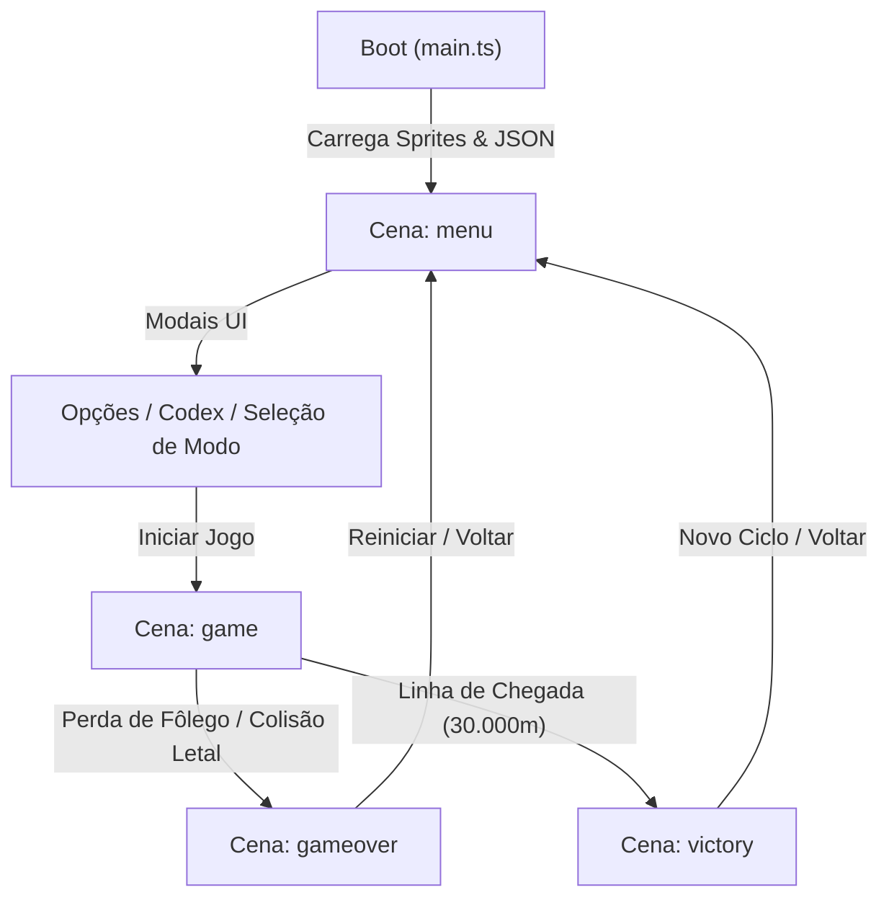
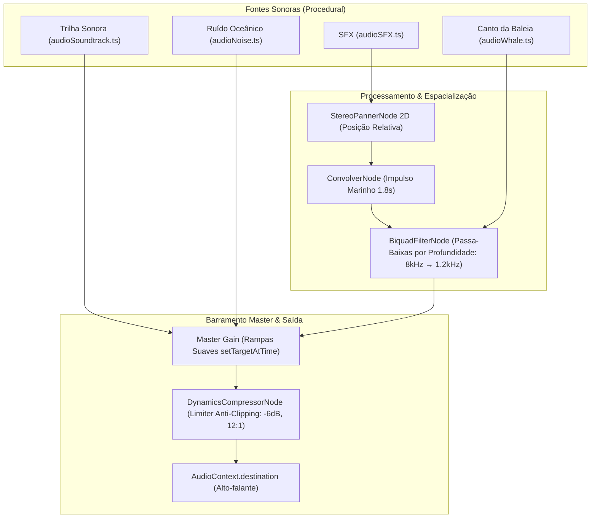

# 🏗️ Arquitetura do Sistema - Micro Splash

O **Micro Splash** foi construído sobre uma arquitetura modular orientada a eventos e componentes, utilizando a engine **Kaboom.js** combinada a **TypeScript**, **Web Audio API** para síntese procedural em tempo real e empacotamento ultrarrápido via **Vite**.

---

## 🗂️ Estrutura de Diretórios e Módulos

```
micro-splash/
├── data/
│   └── facts.json              # Acervo pedagógico de curiosidades marinhas indexadas por bioma
├── docs/
│   ├── ARCHITECTURE.md         # Este documento (visão técnica e estrutural)
│   ├── GDD.md                  # Game Design Document completo
│   ├── OCEAN_FACTS.md          # Fundamentação científica e artigos revisados por pares
│   └── ROADMAP.md              # Roteiro de fases e status de entrega
├── public/
│   └── sprites/
│       └── whale.png           # Spritesheet anatômico de 8 quadros da Baleia-Jubarte
├── scripts/
│   └── generateWhaleSprite.cjs # Script Canvas procedural gerador do spritesheet pixel art
├── src/
│   ├── config.ts               # Parâmetros físicos, biomas, sementes, tags e dimensões
│   ├── main.ts                 # Ponto de entrada, boot do Kaboom.js e máquina de estados de cenas
│   ├── entities/               # Fábricas de atores e objetos interativos do jogo
│   │   ├── boat.ts             # Traineiras de pesca artesanal e barcos da guarda costeira
│   │   ├── iceberg.ts          # Plataforma de gelo polar com fendas de respiração
│   │   ├── krill.ts            # Cardumes alimentares com atração magnética e física oscilatória
│   │   ├── net.ts              # Redes de pesca fantasma com mecânica de enredamento e ruptura
│   │   ├── player.ts           # Jubarte: nado senoidal, animações, sonar 360°, fôlego e esguicho
│   │   ├── ship.ts             # Cargueiros industriais móveis com ruído e perigo de colisão
│   │   └── trash.ts            # Lixo plástico camuflado no fundo com revelação por sonar
│   ├── systems/                # Sistemas de simulação de mundo e áudio
│   │   ├── accessibilitySystem.ts # Daltonismo, escala tipográfica, foco por teclado e narração TTS
│   │   ├── audio/              # Arquitetura modular de áudio e síntese Web Audio API
│   │   │   ├── audioEngine.ts  # Master bus, limiter, convolver reverb, filtro de profundidade e ciclo de aba
│   │   │   ├── audioNoise.ts   # Geradores de ruído rosa e marrom com crossfade
│   │   │   ├── audioSFX.ts     # Efeitos sonoros proceduralmente sintetizados e espacialização estéreo 2D
│   │   │   ├── audioSoundtrack.ts # Trilha adaptativa "Aquatic Ambiance" com crossfade
│   │   │   └── audioWhale.ts   # Canto da baleia em 3 canais síntese FM acionado por sonar
│   │   ├── backgroundFauna.ts  # Fauna decorativa: orcas, jubartes passantes e berçário mãe/filhote
│   │   ├── benthicFloorSystem.ts # Florestas de Kelp fototrópicas e Recifes de Corais pulsantes
│   │   ├── biomeSystem.ts      # Gerenciamento de profundidade, cor da água e densidade por bioma
│   │   ├── canyonSystem.ts     # Geração procedural dos cânions rochosos do Boqueirão
│   │   ├── collisions.ts       # Detecção e resposta a colisões físicas, dano e salvamento
│   │   ├── dolphinDraftingSystem.ts # Nado em vácuo hidrodinâmico cooperativo com golfinhos
│   │   ├── iceSurface.ts       # Banquise de gelo quebrável com física de impacto e espuma
│   │   ├── letterboxSystem.ts  # Enquadramento e fidelidade 16:9 em resoluções altas
│   │   ├── oceanCurrentsSystem.ts # Correntes com empuxo físico e linhas vetoriais de fluxo visíveis
│   │   ├── penguinFlockSystem.ts # Bandos de pinguins saltadores na Antártica
│   │   └── upwellingSystem.ts  # Jatos de ressurgência em leque com gradiente de opacidade
│   └── ui/                     # Camada visual de interface, menus e modais
│       ├── challengeEndScreen.ts # Tela de estatísticas do Desafio Rápido de 60 segundos
│       ├── codexScreen.ts      # Diário de Bordo da Expedição (espécies, fatos e IBJ)
│       ├── hud.ts              # Medidores dinâmicos de fôlego, progresso e notificações
│       ├── modeSelectModal.ts  # Seletor visual de modos (Normal, Serena, Desafio Semanal)
│       ├── optionsModal.ts     # Painel de controle de volume, resolução, acessibilidade e controles
│       └── victoryScreen.ts    # Relatório de Migração de 30.000m e celebração com confetes
```

---

## 🔄 1. Ciclo de Vida e Máquina de Cenas (`src/main.ts`)

O jogo gerencia a navegação entre estados através de 4 cenas principais do Kaboom.js:


```mermaid
graph TD
    BOOT["Boot (main.ts)"] -->|"Carrega Sprites & JSON"| MENU["Cena: menu"]
    MENU -->|"Modais UI"| MODALS["Opções / Codex / Seleção de Modo"]
    MODALS -->|"Iniciar Jogo"| GAME["Cena: game"]
    GAME -->|"Perda de Fôlego / Colisão Letal"| GAMEOVER["Cena: gameover"]
    GAME -->|"Linha de Chegada (30.000m)"| VICTORY["Cena: victory"]
    GAMEOVER -->|"Reiniciar / Voltar"| MENU
    VICTORY -->|"Novo Ciclo / Voltar"| MENU
```

- **`menu`**: Tela inicial receptiva com partículas bioluminescentes, recordes persistentes e interface modal bloqueante (`isModalOpen`).
- **`game`**: Instancia o mundo de 30.000m, o jogador, os sistemas de bioma, áudio, fauna e colisões de acordo com o modo selecionado.
- **`gameover`**: Sequência dramática com tentativa de resgate pela Guarda Marítima na Costa Urbana.
- **`victory`**: Clímax do Salto Majestoso (_Breach_), cálculo do Eco-Score e exibição da Sabedoria Ancestral herdada.

---

## 🐋 2. Entidade Jogador (`src/entities/player.ts`)

A Baleia-Jubarte é uma entidade multifacetada que unifica mecânicas de física hidrodinâmica, animação por spritesheet e sensoriamento ecolocalizador:

1. **Hidrodinâmica Senoidal:**
   - A propulsão via `Espaço` atinge o ápice de aceleração aos `0.3s` e decai a zero se segurada indefinidamente, incentivando o ritmo biológico natural de batida de cauda.
   - Arrasto hidrodinâmico (_drag_) e inércia contínua de fluido desaceleram suavemente o animal ao cessar o esforço.
2. **Spritesheet & Animações (`public/sprites/whale.png`):**
   - **`glide` (quadro 0):** Nado planado hidrodinâmico.
   - **`stroke_up` (quadro 1) & `stroke_down` (quadro 2):** Batida vigorosa dos flukes da cauda.
   - **`feed` (quadro 3):** Distensão das pregas ventrais e exposição de cerdas filtradoras (_baleen_) ao engolir krill.
3. **Esguicho do Espiráculo (_Blowhole Spout_):**
   - Ao emergir à superfície (`SEA_LEVEL`), dispara um esguicho duplo vertical em "V" com 32 partículas e ruído sibilante (_whoosh_) de descompressão pulmonar.
4. **Biosonar 360° Omnidirecional:**
   - Varredura de onda acústica em tela inteira (raio de 650px) ativada por `Shift`, `E` ou `X`.
   - Ilumina e destaca com contorno fluorescente objetos camuflados nas profundezas (lixo plástico, redes e paredes de cânions).

---

## 🎵 3. Sistema de Áudio Modular & Masterização 16-Bit (`src/systems/audio/`)

O áudio do jogo é gerado **100% em tempo real** via Web Audio API, sem depender de arquivos de áudio externos, operando em uma arquitetura modular de barramentos com masterização profissional:


```mermaid
graph TD
    subgraph SINTESE["Fontes Sonoras (Procedural)"]
        SFX["SFX (audioSFX.ts)"]
        WHALE["Canto da Baleia (audioWhale.ts)"]
        MUSIC["Trilha Sonora (audioSoundtrack.ts)"]
        OCEAN["Ruído Oceânico (audioNoise.ts)"]
    end

    subgraph PROCESSAMENTO["Processamento & Espacialização"]
        PANNER["StereoPannerNode 2D (Posição Relativa)"]
        REVERB["ConvolverNode (Impulso Marinho 1.8s)"]
        FILTER["BiquadFilterNode (Passa-Baixas por Profundidade: 8kHz → 1.2kHz)"]
    end

    subgraph MASTERING["Barramento Master & Saída"]
        MASTER["Master Gain (Rampas Suaves setTargetAtTime)"]
        LIMITER["DynamicsCompressorNode (Limiter Anti-Clipping: -6dB, 12:1)"]
        DEST["AudioContext.destination (Alto-falante)"]
    end

    SFX --> PANNER
    PANNER --> REVERB
    REVERB --> FILTER
    WHALE --> FILTER
    MUSIC --> MASTER
    OCEAN --> MASTER
    FILTER --> MASTER
    MASTER --> LIMITER
    LIMITER --> DEST
```

- **Masterização e Limiter Anti-Clipping:** Inserção de `DynamicsCompressorNode` (threshold `-6dB`, ratio `12:1`, attack `3ms`, release `250ms`) na saída master, prevenindo distorção e estalos quando múltiplos SFX disparam ao mesmo tempo.
- **Rampas de Ganho sem Cliques (De-clicking):** Todos os controles de volume, comutação de mudo e alternância de trilhas utilizam interpolação assintótica `setTargetAtTime(val, now, 0.05)` para garantir transições auditivas aveludadas.
- **Espacialização Estéreo 2D (`StereoPannerNode`):** SFX de colisões, krill, redes, gelo, cliques de golfinhos e cargueiros calculam o balanço estéreo em `[-1, 1]` baseado na distância horizontal relativa à baleia (`(sourceX - playerX) / 400`).
- **Acústica Abissal & Reverb Convolutivo:**
  - Barramento com resposta de impulso sintética simulando reflexões acústicas oceânicas.
  - Filtro dinâmico passa-baixas modulado pelo eixo Y da jubarte: na superfície o som atinge `8.000 Hz` (límpido e aerado) e nas profundezas escuras decai até `1.200 Hz` (abafado e grave).
- **Trilha Adaptativa com Crossfade:** Transição gradual de ~0.6s entre os modos _Chiptune Dinâmica_, _Ambiente Contemplativo_ e _Modo Foco_.
- **Ciclo de Vida da Aba (`document.visibilitychange`):** Suspensão automática do `AudioContext` quando a aba é ocultada e retomada graciosa ao retornar, otimizando processamento.
- **Loop Oceânico sem Costura:** Ambiência marrom contínua com blend cruzado de 50ms nos extremos do buffer, eliminando emendas rítmicas.

---

## 🗺️ 4. Geometria dos Biomas e Level Design (`src/config.ts` & `src/systems/`)

A rota de 30.000 metros é particionada em zonas geográficas e comportamentais estritas:

| Faixa (Metros)        | Bioma                         | Tom da Água                | Elementos Chave                                                               |
| :-------------------- | :---------------------------- | :------------------------- | :---------------------------------------------------------------------------- |
| **0m – 5.000m**       | Antártica (Alimentação Polar) | Azul Gélido (`#051c38`)    | Teto de gelo, fendas de respiração, fartura de Krill, silhuetas de orcas.     |
| **5.000m – 12.000m**  | Oceano Aberto (Travessia)     | Azul Escuro (`#0a2850`)    | Jejum total de Krill, correntes, nado de jubartes adultas ao fundo.           |
| **12.000m – 19.000m** | Costa Urbana (Ameaças)        | Verde Urbano (`#0d3c5e`)   | Navios industriais, poluição sonora, lixo camuflado, redes e Guarda Marítima. |
| **19.000m – 25.000m** | Cânions de Ressurgência       | Turquesa (`#0e668b`)       | Jatos d'água ascensionais, fendas estreitas do Boqueirão e nutrientes.        |
| **25.000m – 30.000m** | Santuário de Arraial          | Turquesa Claro (`#1490b8`) | Águas rasas, berçário (mãe e filhote) e evento de Salto Majestoso (29.700m).  |

---

## 💾 5. Persistência de Dados

O jogo utiliza o `localStorage` do navegador para manter o estado persistente entre sessões de forma 100% offline-first:

- **`micro_splash_options`**: Volumes (Master, Música, SFX), modo de trilha sonora e toggle de mudo.
- **`micro_splash_highscore`**: Maior distância percorrida e pontuação Eco-Score acumulada.
- **`micro_splash_unlocked_facts`**: Array com os IDs dos fatos ecológicos desbloqueados para consulta no Diário de Bordo.
- **`micro_splash_stats`**: Estatísticas cumulativas consolidadas (distância percorrida, krill consumido, redes desvencilhadas, saltos executados).
- **`micro_splash_weekly`**: Semente determinística da semana atual e pontuação obtida no Desafio Semanal.
- **`micro_splash_accessibility`**: Configurações de daltonismo, movimento reduzido (`prefers-reduced-motion`), escala tipográfica e narração TTS.
- **`micro_splash_resolution_*`**: Preferência persistente de resolução 16:9 individualizada por tela conectada.
