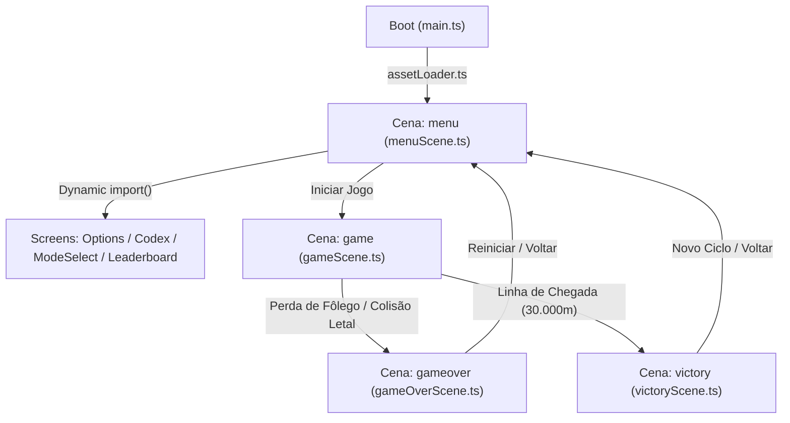
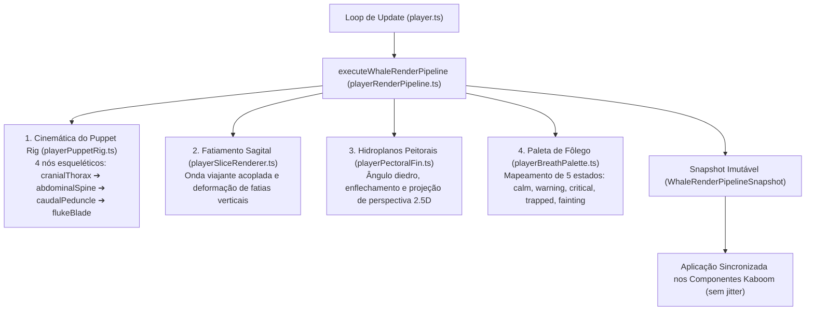
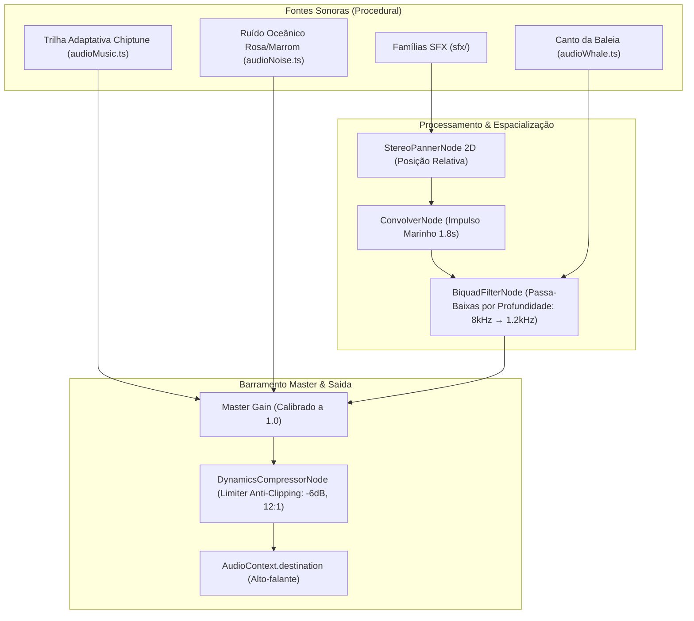

# 🏗️ Arquitetura do Sistema - Micro Splash

O **Micro Splash** foi construído sobre uma arquitetura modular orientada a eventos e componentes, utilizando a engine **Kaboom.js** combinada a **TypeScript**, **Web Audio API** para síntese procedural em tempo real e empacotamento ultrarrápido via **Vite**.

---

## 🗂️ Estrutura de Diretórios e Módulos

```
micro-splash/
├── data/
│   ├── facts.json                  # Acervo pedagógico de curiosidades marinhas indexadas por bioma
│   ├── quiz.json                   # Banco de perguntas e respostas para o desafio educacional
│   └── level_layout.json           # Definição espacial de biomas, densidades e marcos náuticos
├── docs/
│   ├── ARCHITECTURE.md             # Este documento (visão técnica e estrutural)
│   ├── GDD.md                      # Game Design Document completo
│   ├── OCEAN_FACTS.md              # Fundamentação científica e artigos revisados por pares
│   └── ROADMAP.md                  # Roteiro de fases e status de entrega
├── public/
│   ├── fonts/                      # Fontes locais otimizadas (WOFF2 prioritário com fallback TTF)
│   ├── sprites/                    # Texturas e spritesheets (incluindo fauna_manifest.json)
│   ├── offline.html                # Tela de contingência offline PWA estilizada
│   └── sw.js                       # Service Worker com cache LRU versionado dinamicamente
├── scripts/                        # Utilitários de build, validação e geradores em Node/ESM
├── src/
│   ├── config.ts                   # Parâmetros físicos, biomas, sementes, tags e dimensões
│   ├── main.ts                     # Ponto de entrada enxuto e boot do Kaboom.js
│   ├── scenes/                     # Módulos isolados de cenas Kaboom
│   │   ├── assetLoader.ts          # Pré-carregamento determinístico de atlas e recursos
│   │   ├── menuScene.ts            # Cena de menu com code-splitting dinâmico
│   │   ├── gameScene.ts            # Orquestrador do loop de gameplay de 30.000m
│   │   ├── gameOverScene.ts        # Cena dramática de resgate ou fim de jogo
│   │   └── victoryScene.ts         # Cena de celebração com ritual do salto e eco-score
│   ├── entities/                   # Atores e objetos interativos do jogo
│   │   ├── player.ts               # Fachada da Jubarte (orquestração e ciclo de vida)
│   │   ├── player/                 # Módulos especializados de biomecânica e renderização
│   │   │   ├── playerRenderPipeline.ts # Coordenador puro e determinístico de renderização
│   │   │   ├── playerPuppetRig.ts      # Cinemática direta de 4 nós e flukes caudais
│   │   │   ├── playerSliceRenderer.ts  # Fatiamento sagital vertical e onda viajante
│   │   │   ├── playerPectoralFin.ts    # Hidroplanos peitorais com diedro e perspectiva 2.5D
│   │   │   ├── playerBreathPalette.ts  # Colorimetria centralizada dos estados de fôlego
│   │   │   ├── playerAnimation.ts      # Interpolador harmônico de spritesheet de 16 quadros
│   │   │   ├── playerDrift.ts          # Simulação de balanço de maré e deriva orbital
│   │   │   ├── playerCaustics.ts       # Iluminação e cáusticos ventrais dinâmicos
│   │   │   ├── playerCollision.ts      # Gerenciamento de redes, armadilhas e salvamento
│   │   │   └── playerParticles.ts      # Spawners de vórtices peitorais e bolhas
│   │   ├── boat.ts                 # Traineiras de pesca artesanal e barcos da guarda costeira
│   │   ├── iceberg.ts              # Plataforma de gelo polar com fendas de respiração
│   │   ├── krill.ts                # Cardumes alimentares com atração magnética e física oscilatória
│   │   ├── net.ts                  # Redes de pesca fantasma com mecânica de enredamento e ruptura
│   │   ├── ship.ts                 # Cargueiros industriais móveis com ruído e perigo de colisão
│   │   └── trash.ts                # Lixo plástico camuflado no fundo com revelação por sonar
│   ├── systems/                    # Sistemas de simulação de mundo, áudio e acessibilidade
│   │   ├── accessibilitySystem.ts  # Daltonismo, tipografia, foco e movimento reduzido
│   │   ├── audioSystem.ts          # Fachada canônica para o subsistema de áudio
│   │   ├── audio/                  # Arquitetura modular de áudio e síntese Web Audio API
│   │   │   ├── audioEngine.ts      # Master bus, limiter (-6dB), convolver e ciclo de aba
│   │   │   ├── audioMusic.ts       # Motor musical procedural com crossfade entre biomas
│   │   │   ├── audioNoise.ts       # Geradores de ruído marrom/rosa para ambiência
│   │   │   ├── audioWhale.ts       # Canto da baleia em síntese FM acionado por sonar
│   │   │   └── sfx/                # Efeitos sonoros divididos por famílias temáticas
│   │   ├── spatialCullingSystem.ts # Culling frustum com histerese e visibilidade O(1)
│   │   ├── biomeLifecycleManager.ts# Ciclo de vida e desova determinística de entidades
│   │   └── ...
│   ├── ui/                         # Interface do usuário decomposta e modular
│   │   ├── screens/                # Telas completas (optionsScreen, codexScreen, etc.)
│   │   ├── modals/                 # Diálogos modais (quizModal, shareModal, statsModal)
│   │   ├── hud/                    # Componentes do HUD de navegação e oxigênio
│   │   ├── shared/                 # Componentes compartilhados e botões padronizados
│   │   ├── animationUtils.ts       # Tokens UI_TRANSITIONS e transições com easings
│   │   └── keyboardNav.ts          # Pilha LIFO de foco com suporte a focus trap
│   └── utils/                      # Funções puras, persistência e matemática determinística
│       ├── storage.ts              # Persistência desacoplada validada com schemas Zod
│       ├── random.ts               # PRNG determinístico Mulberry32 com semente
│       ├── contrast.ts             # Algoritmo de contraste e luminância WCAG 2.1 AA
│       └── errorReporter.ts        # Barramento unificado de telemetria e erros
```

---

## 🔄 1. Ciclo de Vida e Máquina de Cenas (`src/scenes/`)

O jogo gerencia a navegação entre estados através de cenas modulares do Kaboom.js com suporte a **Code-Splitting assíncrono**:


```mermaid
graph TD
    BOOT["Boot (main.ts)"] -->|"assetLoader.ts"| MENU["Cena: menu (menuScene.ts)"]
    MENU -->|"Dynamic import()"| SCREENS["Screens: Options / Codex / ModeSelect / Leaderboard"]
    MENU -->|"Iniciar Jogo"| GAME["Cena: game (gameScene.ts)"]
    GAME -->|"Perda de Fôlego / Colisão Letal"| GAMEOVER["Cena: gameover (gameOverScene.ts)"]
    GAME -->|"Linha de Chegada (30.000m)"| VICTORY["Cena: victory (victoryScene.ts)"]
    GAMEOVER -->|"Reiniciar / Voltar"| MENU
    VICTORY -->|"Novo Ciclo / Voltar"| MENU
```

- **`assetLoader`**: Pré-carrega de forma determinística os atlas de sprites, manifesto de fauna e fontes antes da ativação do menu inicial.
- **`menuScene`**: Tela inicial receptiva com partículas bioluminescentes, recordes persistentes e interface modal bloqueante (`isModalOpen`). Importa telas sob demanda com `await import(...)`.
- **`gameScene`**: Instancia a rota de 30.000m, o jogador via singleton O(1), os sistemas de bioma, áudio, fauna e colisões de acordo com o modo selecionado.
- **`gameOverScene`**: Sequência dramática com tentativa de resgate pela Guarda Marítima na Costa Urbana.
- **`victoryScene`**: Clímax do Salto Majestoso (_Breach_), cálculo do Eco-Score e exibição da Sabedoria Ancestral herdada.

---

## 🐋 2. Entidade Jogador & Pipeline Biomecânica (`src/entities/player/`)

A Baleia-Jubarte utiliza uma arquitetura puramente determinística baseada no coordenador central `playerRenderPipeline.ts`. O loop de física alimenta o coordenador, que calcula a cinemática e devolve um snapshot imutável (`WhaleRenderPipelineSnapshot`):


```mermaid
graph TD
    UPDATE["Loop de Update (player.ts)"] --> PIPELINE["executeWhaleRenderPipeline (playerRenderPipeline.ts)"]
    PIPELINE --> RIG["1. Cinemática do Puppet Rig (playerPuppetRig.ts)<br/>4 nós esqueléticos: cranialThorax ➔ abdominalSpine ➔ caudalPeduncle ➔ flukeBlade"]
    PIPELINE --> SLICE["2. Fatiamento Sagital (playerSliceRenderer.ts)<br/>Onda viajante acoplada e deformação de fatias verticais"]
    PIPELINE --> FINS["3. Hidroplanos Peitorais (playerPectoralFin.ts)<br/>Ângulo diedro, enflechamento e projeção de perspectiva 2.5D"]
    PIPELINE --> PALETTE["4. Paleta de Fôlego (playerBreathPalette.ts)<br/>Mapeamento de 5 estados: calm, warning, critical, trapped, fainting"]
    PIPELINE --> SNAPSHOT["Snapshot Imutável (WhaleRenderPipelineSnapshot)"]
    SNAPSHOT --> APPLY["Aplicação Sincronizada nos Componentes Kaboom (sem jitter)"]
```

### Detalhamento das Camadas Biomecânicas

1. **Cinemática Direta do Puppet Rig (`playerPuppetRig.ts`):**
   - Resolve a cadeia de 4 juntas articuladas da jubarte em espaço local.
   - Calcula o ângulo de ataque ótimo da lâmina caudal contra o fluxo hidrodinâmico, gerando empuxo realista tanto na batida descendente quanto ascendente.
2. **Deformação Sagital por Fatiamento Segmentado (`playerSliceRenderer.ts`):**
   - Divide o corpo da baleia em fatias verticais anatômicas interpoladas por uma onda senoidal viajante amortecida.
   - Atenua automaticamente a amplitude da flexão em 75% quando a preferência de movimento reduzido (`isReducedMotion`) está ativa.
3. **Hidroplanos Peitorais Independentes (`playerPectoralFin.ts`):**
   - Simula as longas nadadeiras peitorais brancas da jubarte com variação de ângulo diedro (sustentação/mergulho) e enflechamento hidrodinâmico conforme a velocidade.
   - Camadas organizadas por profundidade z-index para simular perspectiva tridimensional no plano 2D.
4. **Colorimetria Centralizada por Estado de Fôlego (`playerBreathPalette.ts`):**
   - Mapeia as cores de corpo, nadadeiras e pregas em 5 estados biológicos:
     - **Calm** (oxigênio > 50%): tonalidade natural límpida.
     - **Warning** (20% a 50%): transição âmbar de alerta com dessaturação.
     - **Critical** (< 20%): pulso rítmico de urgência e cianose.
     - **Trapped** (emaranhamento): matiz púrpura característico de aprisionamento em redes de pesca.
     - **Fainting** (anóxia/desmaio): tonalidade profunda e fosca.
5. **Spritesheet Harmônico de 16 Quadros (`playerAnimation.ts`):**
   - Ciclos de animação de alta fluidez desenhados à mão, com interpolação contínua proporcional à velocidade de nado e cadência respiratória.
6. **Física de Deriva Orbital e Cáusticos (`playerDrift.ts` & `playerCaustics.ts`):**
   - Aplica balanço oceânico e deriva de maré ao permanecer estática, sincronizada com ondulações de luz cáustica ventral.

---

## 🎵 3. Sistema de Áudio Modular & Masterização 16-Bit (`src/systems/audio/`)

O áudio do jogo é gerado **100% em tempo real** via Web Audio API, sem depender de arquivos de áudio externos, operando em uma arquitetura modular de barramentos com masterização profissional:


```mermaid
graph TD
    subgraph SINTESE["Fontes Sonoras (Procedural)"]
        SFX["Famílias SFX (sfx/)"]
        WHALE["Canto da Baleia (audioWhale.ts)"]
        MUSIC["Trilha Adaptativa Chiptune (audioMusic.ts)"]
        OCEAN["Ruído Oceânico Rosa/Marrom (audioNoise.ts)"]
    end

    subgraph PROCESSAMENTO["Processamento & Espacialização"]
        PANNER["StereoPannerNode 2D (Posição Relativa)"]
        REVERB["ConvolverNode (Impulso Marinho 1.8s)"]
        FILTER["BiquadFilterNode (Passa-Baixas por Profundidade: 8kHz → 1.2kHz)"]
    end

    subgraph MASTERING["Barramento Master & Saída"]
        MASTER["Master Gain (Calibrado a 1.0)"]
        LIMITER["DynamicsCompressorNode (Limiter Anti-Clipping: -6dB, 12:1)"]
        DEST["AudioContext.destination (Alto-falante)"]
    end

    SFX --> PANNER
    PANNER --> REVERB
    REVERB --> FILTER
    WHALE --> FILTER
    MUSIC --> MASTER
    OCEAN --> MASTER
    FILTER --> MASTER
    MASTER --> LIMITER
    LIMITER --> DEST
```

- **Masterização e Limiter Anti-Clipping:** Inserção de `DynamicsCompressorNode` (threshold `-6dB`, ratio `12:1`, attack `3ms`, release `250ms`) na saída master. Ganho calibrado para evitar distorção ou bombeamento na presença de múltiplos SFX simultâneos.
- **Rampas de Ganho sem Cliques (De-clicking):** Todos os controles de volume e alternâncias de trilhas utilizam interpolação assintótica `setTargetAtTime` para assegurar transições suaves.
- **Crossfade Chiptune entre Biomas:** Transição harmônica suave de 1.5s a 2.0s via rampa de ganho entre os temas procedurais dos 4 biomas, preservando o andamento fixo de 75 BPM.
- **Espacialização Estéreo 2D (`StereoPannerNode`):** SFX de colisões, krill, redes, gelo, cliques de golfinhos e cargueiros calculam balanço estéreo em `[-1, 1]` baseado na distância horizontal relativa `(sourceX - playerX) / 400`.
- **Acústica Abissal & Reverb Convolutivo:** Resposta de impulso sintética de 1.8s simulando reflexões subaquáticas combinada a filtro passa-baixas modulado pela profundidade (8.000 Hz na lâmina d'água até 1.200 Hz nas fossas).

---

## 🗺️ 4. Geometria dos Biomas e Level Design (`src/config.ts` & `src/systems/`)

A rota de 30.000 metros é particionada em zonas geográficas e comportamentais estritas:

| Faixa (Metros)        | Bioma                         | Tom da Água                | Elementos Chave                                                               |
| :-------------------- | :---------------------------- | :------------------------- | :---------------------------------------------------------------------------- |
| **0m – 5.000m**       | Antártica (Alimentação Polar) | Azul Gélido (`#051c38`)    | Teto de gelo, fendas de respiração, fartura de Krill, silhuetas de orcas.     |
| **5.000m – 12.000m**  | Oceano Aberto (Travessia)     | Azul Escuro (`#0a2850`)    | Jejum total de Krill, correntes, nado de jubartes adultas ao fundo.           |
| **12.000m – 19.000m** | Costa Urbana (Ameaças)        | Verde Urbano (`#0d3c5e`)   | Navios industriais, poluição sonora, lixo camuflado, redes e Guarda Marítima. |
| **19.000m – 25.000m** | Cânions de Ressurgência       | Turquesa (`#0e668b`)       | Jatos d'água ascensionais, fendas estreitas do Boqueirão e nutrientes.        |
| **25.000m – 30.000m** | Santuário de Arraial          | Turquesa Claro (`#1490b8`) | Águas rasas, berçário (mãe e filhote) e evento de Salto Majestoso (29.700m).  |

---

## 🖥️ 5. Arquitetura de UI, Code-Splitting & Acessibilidade (`src/ui/`)

A camada de interface gráfica é desacoplada da lógica central de simulação:

1. **Reorganização em Subdomínios Semânticos:**
   - `src/ui/screens/`: Telas completas (`optionsScreen`, `codexScreen`, `victoryScreen`, `challengeEndScreen`).
   - `src/ui/modals/`: Caixas de diálogo modais isoladas (`quizModal`, `shareModal`, `statsModal`, `pwaInstallModal`).
   - `src/ui/hud/`: Instrumentação em tempo real (oxigênio, velocímetro, sonar, alertas e minimapa).
   - `src/ui/shared/`: Componentes reutilizáveis com efeitos táteis universais (`attachButtonHoverEffect`).
2. **Code-Splitting Dinâmico:**
   - As telas e modais pesados são carregados sob demanda através de `await import(...)`, permitindo que o chunk principal inicial do jogo seja enxuto (~232 kB gzipped em produção).
3. **Tokens e Transições de Animação (`src/ui/animationUtils.ts`):**
   - Constantes centralizadas `UI_TRANSITIONS` (`MODAL_ENTER_DURATION`, `MODAL_EXIT_DURATION`, `FADE_SCENE_DURATION`, `BUTTON_HOVER_SCALE`, `TOAST_DURATION`).
   - `animateModalExit` com easing cúbico para saída simétrica antes da destruição dos nós Kaboom.
4. **Pilha de Foco Acessível (LIFO) & Focus Trap (`src/ui/keyboardNav.ts`):**
   - Suporte completo a navegação por teclado (Tab, Shift+Tab, setas direcionais, Enter/Espaço para acionamento).
   - Ao abrir um modal, o elemento ativo anterior é preservado no snapshot da pilha e automaticamente restaurado ao fechar.
5. **Auditoria de Contraste WCAG 2.1 AA & Formatação Internacionalizada:**
   - `src/utils/contrast.ts`: Validação de taxa de contraste superior a 4.5:1 para textos regulares e 3.0:1 para badges grandes sobre fundos translúcidos.
   - `src/i18n/i18n.ts`: Formatação numérica, métrica (milhas náuticas e metros) e datas localizada via `Intl` nativo com suporte total a `pt-BR`, `en-US` e `gn` (Guarani Nhandewa).
6. **Diário de Bordo da Migração Serena (`src/systems/sereneMigrationInsights.ts`):**
   - Módulo educativo interativo com catálogo de 10 momentos da ecologia da jubarte (filtração de krill, respiração, hidrodinâmica, polínias, canal SOFAR, drafting, ameaça de plásticos, redes, ressurgência e berçário).
   - Gerenciador com fila anti-sobreposição, temporização pedagógica (5.5s), transições acessíveis e integração com narração por voz (TTS).

---

## 💾 6. Persistência de Dados & Schemas Zod (`src/utils/storage.ts`)

O armazenamento local utiliza exclusivamente a fachada tipada `readLocalStorageWithSchema` e `writeLocalStorage` validada por schemas Zod (`src/types/storageSchemas.ts`), blindando a aplicação contra dados corrompidos ou tipos inconsistentes:

- **`micro_splash_options`**: Volumes (Master, Música, SFX), modo de trilha sonora e mute.
- **`micro_splash_highscore`**: Maior distância percorrida e pontuação Eco-Score acumulada.
- **`micro_splash_unlocked_facts`**: Identificadores dos fatos pedagógicos desbloqueados no Codex.
- **`micro_splash_stats`**: Estatísticas cumulativas (distância total, krill consumido, redes rompidas, saltos executados).
- **`micro_splash_weekly`**: Semente determinística da semana e pontuação obtida no Desafio Semanal.
- **`micro_splash_accessibility`**: Configurações de daltonismo, movimento reduzido, alto contraste e escala tipográfica.
- **`micro_splash_resolution_*`**: Resolução 16:9 individualizada por monitor.

---

## 📱 7. PWA Versionado, Cache Offline & Culling de Performance

1. **Service Worker Versionado Dinamicamente (`pwaVersionPlugin` & `public/sw.js`):**
   - O Vite injeta dinamicamente o número da versão do `package.json` no Service Worker na compilação.
   - Poda de cache LRU automática (`trimCache`) mantendo no máximo 60 itens no cache dinâmico para evitar estouro de memória em totens e quiosques.
   - `public/offline.html`: Página de fallback offline glassmórfica exibida quando a conexão falha em recursos não pré-cacheados.
2. **Culling Espacial com Margens de Histerese (`src/systems/spatialCullingSystem.ts`):**
   - Assegura 60 FPS estáveis ao alternar dinamicamente a propriedade `hidden` de obstáculos, fauna e flora que saem da viewport da câmera, evitando chamadas de desenho redundantes no WebGL.
3. **Singleton O(1) do Jogador:**
   - As consultas repetidas `k.get("player")` foram substituídas por um ponteiro direto em memória, eliminando a sobrecarga de varreduras lineares por quadro.
